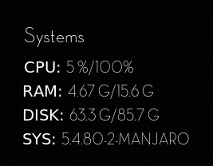
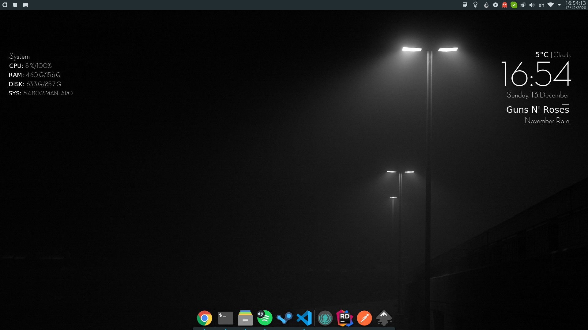

# SSUI Conky

SSUI is a modular conky suite.
It consists of following modules:
- Clock
- Spotify
- System

Use config file to enable/disable widgets.


# Preview

## Clock


## Spotify


## System



## Full




# Requirements

## General requirements 
- conky 1.11 (it may work on older version, but it is not tested)
- lua 5.4 (it may work on older version, but it is not tested)
- font Adele (can be found in `assets` directory)

| Module  | Requirements |
| ------  | ------------ |
| clock   | -            |
| spotify | spotify      |
| system  | -            |


# Install

SSUI is expected to be installed in `~/.conky/ssui`.

Run `install.sh` (check if you have execution permission) or do it manually.


# Usage

## Configuration

Before running SSUI you maybe want to configure it.

Update entries `config.lua` to enable or disable some module.

```lua
return {
  clock = true, 
  system = true, -- change it to false maybe?
  spotify = true
}
```

When configuration is updated SSUI will require restart to take in the effect.


## Running

Run `start.sh`. Simple as that.


## Autostart [Manjaro KDE Example]

You would probably like to start it automatically so here is what you can do.

*Note*: you may need to make some changes to suit yourself.

1. Create desktop file
```bash
nano ~/.config/autostart/ssui-conky.desktop
```

2. Paste this into the file
```
[Desktop Entry]
Comment=Collection of conky widgets
Exec=sleep 10 && ~/.conky/ssui/start.sh > /dev/null 2>&1 &
Icon=conky
Name=SSUI Conky
Terminal=false
TerminalOptions=
Type=Application

```
3. Done